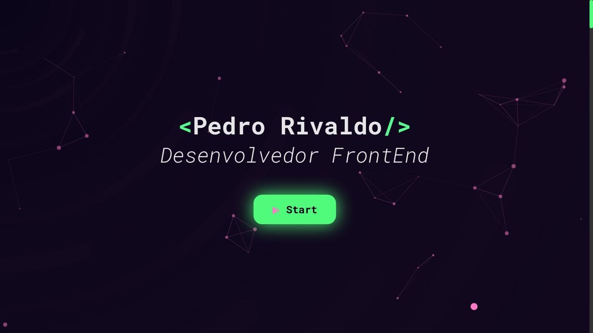
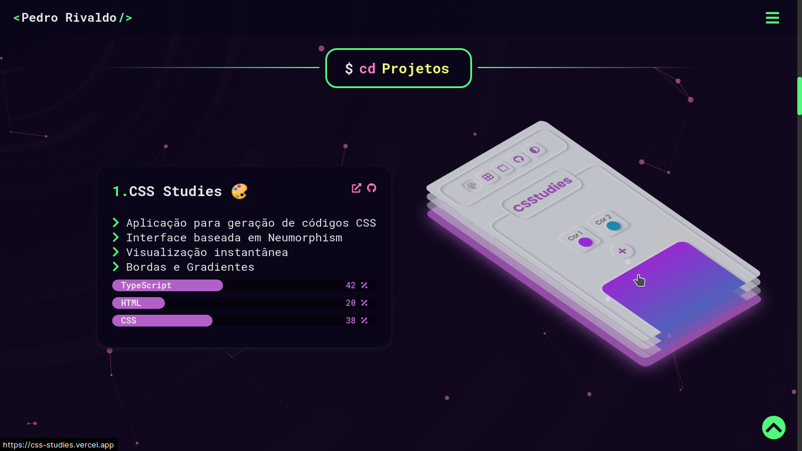
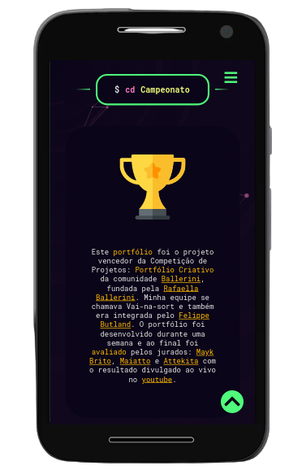

# 1ª Competição de Projetos: Portfólio Criativo

Acessar: [https://pedrorivaldo.me](https://www.pedrorivaldo.me)

Este portfólio foi o projeto vencedor da Competição de Projetos: Portfólio Criativo da comunidade Ballerini, fundada pela [Rafaella Ballerini](https://github.com/rafaballerini).

Minha equipe se chamava Vai-na-sort e também era integrada pelo [Felippe Butland](https://github.com/felippebutland). 

O portfólio foi desenvolvido durante uma semana e ao final foi avaliado pelos jurados: [Mayk Brito](https://github.com/maykbrito), [Maiatto](https://github.com/rafaelmaiach) e [Attekita](https://github.com/Bullas) com o resultado divulgado ao vivo no youtube.

